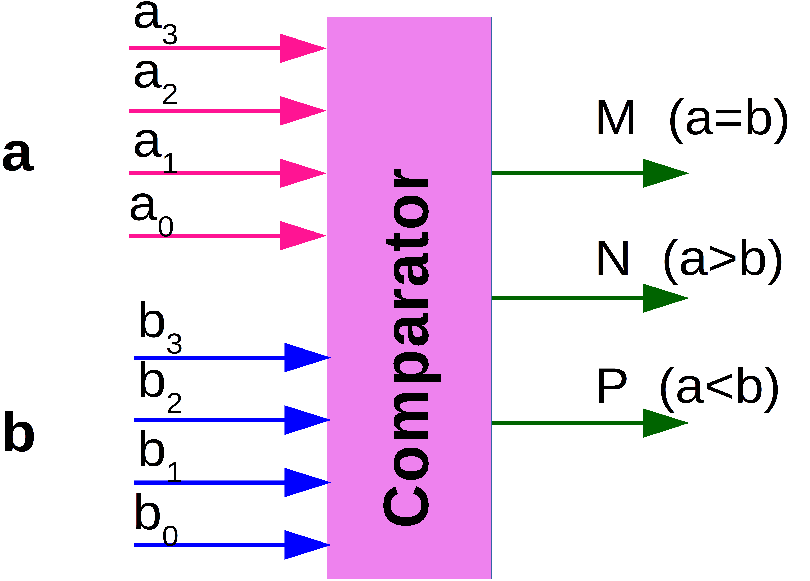

# Take Home Exercise - 6.Combinational Circuit


### 1. Describe the following logical expression in Vivado-HLS

```c
f=(a OR (b AND c))XOR(e OR (f AND g))
```
    a) Synthesise the code and make sure that the resulted hardware is combinational 

    b) By looking at the synthesis report find the approximation of the design propagation delay

### Solution:

```c
void boolian_expression( bool a, 
						 bool b,
						 bool c, 
						 bool e,
						 bool g,
						 bool &f )
						 

{
	#pragma HLS INTERFACE mode=ap_ctrl_none port=return
	#pragma HLS INTERFACE mode=ap_none port=a
	#pragma HLS INTERFACE mode=ap_none port=b
	#pragma HLS INTERFACE mode=ap_none port=c
	#pragma HLS INTERFACE mode=ap_none port=e
	#pragma HLS INTERFACE mode=ap_none port=g
	#pragma HLS INTERFACE mode=ap_none port=f
	
	
	f = ( a || (b && c) ^ (e || (f && g) ) )
}

```


### 2. Describe an 8-bit binary adder in Vivado-HLS using the full-adder circuit proposed in the fifth lecture of this section.

    a) Synthesise the code into a combinational circuit and find the design propagation delay.

    b) What is the resource utilisation of LUTs?

    c) Using the Vivado toolset generate the FPGA bitstream and check the results on the Basys3 board.

### Solution:

```C
write code here

```


### 3. The following figure shows a 4-bit comparator that takes two 4-bit binary numbers`a3a2a1a0` and `b3b2b1b0` and determines whether they are equal and, if not, which one is larger. There are three outputs, defined as follows:

- `M = 1` only if the two input numbers are equal.

- `N = 1` only if

`a3a2a1a0` is greater than `b3b2b1b0`.
`P = 1` only if `b3b2b1b0` is greater than `a3a2a1a0`.



### Solution:
```
write code here
```


